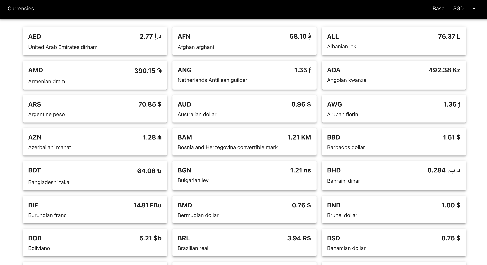
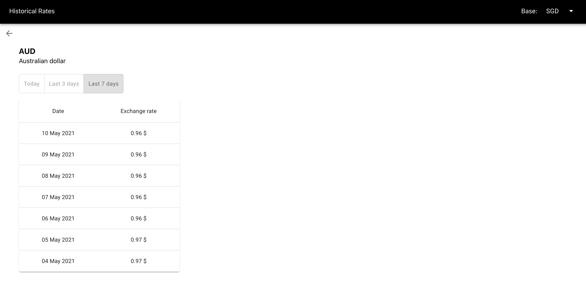

# Exchange Rates

This project shows the historical exchange rates for a specific currency.  It uses [Express](https://expressjs.com) for backend, and [React](https://reactjs.org) for frontend.  For ui components, it uses [Material-UI](https://material-ui.com/) for material design.

## Preview

## Prerequisite
Sign up to <strong>CurrencyScoop API</strong> in `https://currencyscoop.com`.  Then update the `API_KEY` in `.env` file.

## API

`GET /currencies` - retrieves the list of currencies.

`GET /latest?base={base}` - retrieves the real-time exchange rates for the given `base` currency

`GET /historical?base={base}&currency={currency}&period={timePeriod}` -  retrieves the historical exchange rates for the given `base` currency, selected `currency`, and `timePeriod`.

## Installation

Run `npm install` to install the necessary packages.

## Run

Run `npm run start` to run the application.
